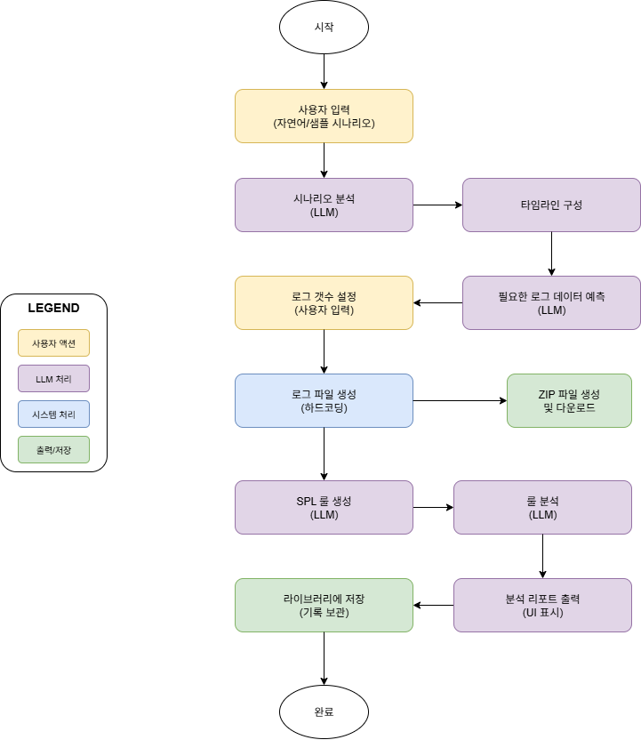

# 🚀 시나리오 기반 다중 로그 생성기

하나의 공격 시나리오를 자연어로 입력하면 **LLM이 가상 로그를 생성**하고,  
이를 Splunk에서 탐지할 수 있는 **맞춤형 SPL 쿼리와 설명 리포트**를 제공하는 학습 플랫폼입니다.  

---

## 📌 목적
- 사용자 입력(공격 시나리오/키워드)에 따라 보안 로그를 자동 생성  
- Splunk 탐지 쿼리(SPL)를 자동으로 생성 및 최적화  
- 쿼리 설명 리포트를 통해 보안 탐지의 이해도와 교육 효과 향상  

---

## ⚙️ 입력값
- 공격 시나리오 (자연어 설명)  
- 시나리오 키워드 (예: 말웨어, 백도어, SQL 인젝션 등)  

## 📤 출력값
- **시나리오 타임라인** + **로그 종류**  
- **가상 로그 ZIP 파일**  
- **시나리오 기반 SPL 쿼리**  
- **쿼리 해석 리포트**  

---

## 📊 플로우 차트
  
(👉 실제 draw.io 다이어그램 첨부 가능)

---

## 🔑 주요 기능

### 1️⃣ 사용자 입력
- 생성할 로그 개수 선택  
- 샘플 시나리오 선택  
- 자연어 시나리오 입력  
- **UI**: Streamlit 웹 인터페이스  

---

### 2️⃣ 사용자 입력 분석
- 자연어 처리(NLP) 기반 시나리오 구조화  
- 부족한 정보 보완 (AI가 시나리오 디테일 추가)  
- 공격 유형 자동 분류 (6가지 카테고리)  
- 오류 처리 (JSON 파싱/오류 핸들링)  

---

### 3️⃣ 시나리오 구체화
- **공격 타임라인** 표시  
- **보안 로그 시스템 매핑**  
- 태그 기반 로그 타입 지정  
- JSON 구조화 예시:

```json
{
  "title": "웹 애플리케이션 침입 공격",
  "attack_type": "web_attack",
  "timeline": [
    "1. 웹 애플리케이션 스캔",
    "2. SQL 인젝션 시도",
    "3. 관리자 계정 탈취"
  ],
  "log_types": [
    {"name": "방화벽", "type": "firewall"},
    {"name": "웹서버", "type": "webserver"}
  ]
}